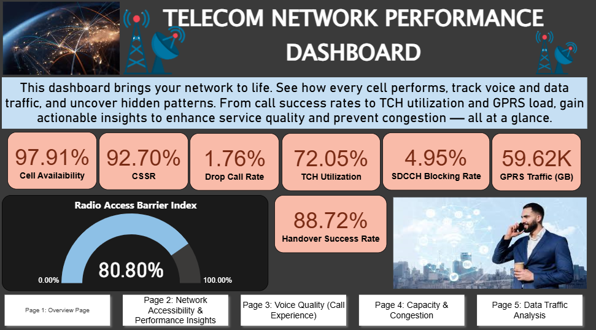
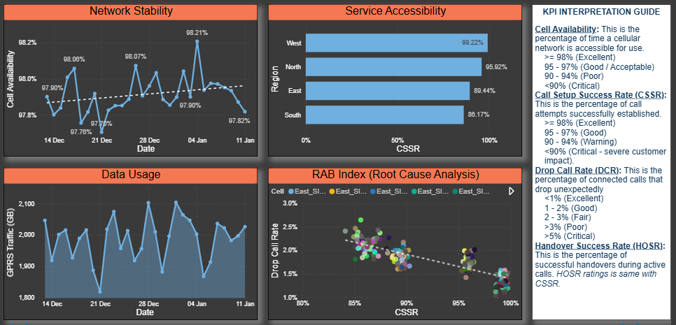
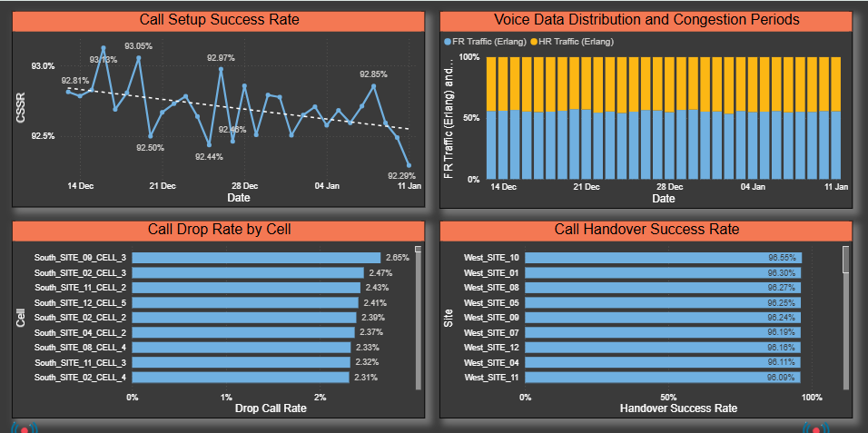
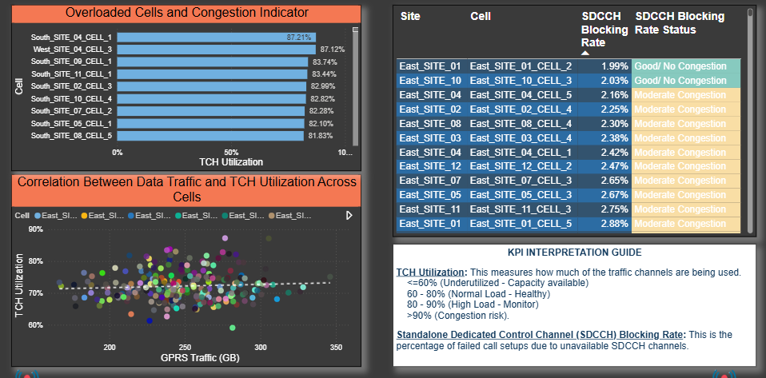
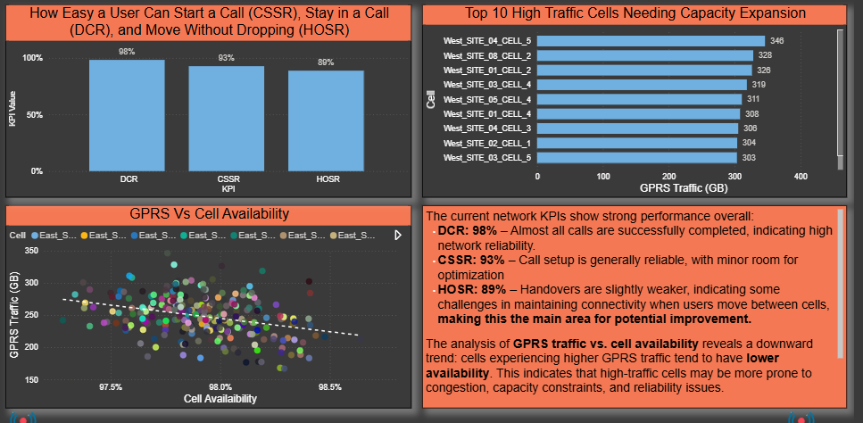

# 📡 Telecom Network Performance Report
Dec 2025 - Jan 2026
## 📖 Overview
This project showcases a Telecom Network Performance Dashboard designed to monitor and analyze voice and data KPIs across regions, sites, and cells. It provides end-to-end visibility into network availability, accessibility, retainability, mobility, and capacity—enabling proactive identification of congestion, quality degradation, and optimization opportunities.

⚠️ Note: To protect sensitive company data, the dataset used here is simulated. It mirrors the structure and KPI logic of the real project, ensuring confidentiality while demonstrating technical and analytical skills.

---

## 🔍 Problem Statement
Telecom operators face challenges in maintaining service quality and capacity as demand for data and voice services grows. Key issues include:
•	Declining accessibility in certain regions.
•	Congestion risks due to high traffic channel utilization.
•	Coverage gaps and handover inefficiencies leading to dropped calls.
•	Rising data traffic requiring proactive capacity planning.

---

## 🎯 Objectives
This project was designed to:
1.	Build a scalable telecom data model covering regions, sites, and cells.
2.	Implement industry-standard KPIs (Cell Availability, CSSR, DCR, HOSR, TCH Utilization, SDCCH Blocking).
3.	Translate complex KPI definitions into efficient DAX measures for accurate reporting.
4.	Create interactive dashboards and paginated reports for executive stakeholders.
5.	Enable root-cause analysis and highlight congestion hotspots with conditional formatting.

---

## 📈 Dashboard Highlights
•	Cell Availability & Accessibility: Identify underperforming sites.
•	Congestion Monitoring: Detect TCH utilization exceeding safe thresholds.
•	Drop Call Analysis: Highlight cells with high DCR due to coverage or interference.
•	Traffic Trends: Reveal increasing data demand to support capacity planning.

### Sample Dashboard Screenshots
**Network Accessibility & Performance Insights**

**Voice Quality and Call Experience**  

**Capacity and Congestion**  

**Data Traffic Analysis**  

---

## 🔑 Key Insights
•	Regions with CSSR below 97% show declining accessibility.
•	Sites with TCH utilization >80% are at risk of congestion.
•	High DCR values point to coverage gaps and mobility inefficiencies.
•	Data traffic demand is steadily increasing, requiring proactive investment.

---

## 🛠 Tools & Technologies
•	**Microsoft Excel** → Data preparation and KPI calculations
•	**Power BI** → Interactive dashboards and paginated reports
•	**Paginated Report** → Executive summary of KPIs and recommendations.
•	**DAX** → KPI definitions and performance measures
•	**Data Modeling** → Structured telecom hierarchy (regions → sites → cells)
•	**Telecom Analytics** → Industry-standard KPI monitoring

---

## 📌 Recommendations
1.	Optimize sites with CSSR <97% and elevated SDCCH blocking.
2.	Expand capacity or offload traffic where TCH utilization >80%.
3.	Investigate cells with persistently high drop call rates.
4.	Continuously monitor data traffic trends to guide network planning.

---

## ✅ Conclusion
This project demonstrates how telecom KPIs can be transformed into actionable insights through data modeling, DAX measures, and interactive dashboards. By simulating real-world datasets, it highlights the importance of proactive monitoring and optimization in ensuring network quality and customer satisfaction.

---

## 📊 Project Deliverables
- **Power BI Dashboard**: Interactive telecom performance dashboard. 
  👉 [View the Live Dashboard and Interact with it](https://app.powerbi.com/view?r=eyJrIjoiZTc5YmZkMzYtMWNiMi00MGQ2LWJmZjctODcxMTNiM2U3OWZmIiwidCI6IjAyMDk2OWQ5LTgyNzMtNGVjOC05Y2YyLTMzYTU1NWM1YmFhMiJ9)

---

## 👤 Author
**Light Amadi**  
Telecom Network Performance Project  
🌐 [www.linkedin.com/in/light-amadi-942628360]
